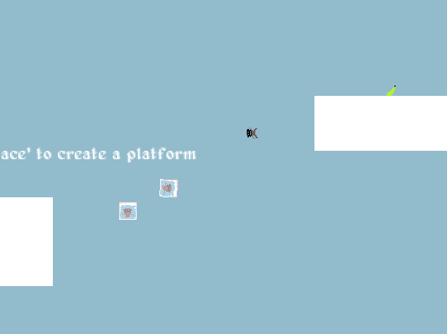

# Monkune
Monkune is a platform-ish game, where you stack monkeys in order to get bananas.



Made for [Librejam 2020-01](https://bytecrab.org/librejam/202101.html), with the
theme of ”cooperation.” It also bears the honor of being the winner… by default,
due to lack of competitors. :^)


## Running
Monkune should run just fine on any operating system with
[LÖVE](https://love2d.org) — including GNU/Linux, BSD, and Haiku.

Make sure LÖVE (`love2d`) is installed with your package manager, and then:  
`$ make test`


### Building
The Makefile can make both the `monkune.love` archive and the Windows executable.
Make sure the `./bin/` directory exists, and that LÖVE is installed with your
package manager.

```
$ make win32
$ make love
```


## Meta
Author: Jaidyn Ann <jadedctrl@posteo.at>  
Code is under the GPLv3 (see COPYING.txt)  
Art assets all under the CC-BY 3.0.
